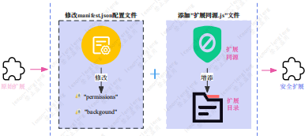

# VE-CSRF-Defense

# 概述
对浏览器扩展进行的安全修改方案，以防御基于浏览器扩展无状态运行机制导致的跨站请求伪造攻击。  
修改示图如下：  
  
输入是一个浏览器扩展包，输出是一个修改好安全的浏览器扩展包。
# 用法
VE-CSRF-Defense对一个浏览器扩展包进行安全修改，在不影响其原始功能的情况下得到一个加固后的浏览器扩展包。

**拷贝代码**  
首先，你应该将我们的所有文件下载到你的linux或window系统中。

**下载浏览器扩展**  
其次，可以从Chrome扩展商城下载你需要的浏览器扩展包或者别的途径获取到的扩展，格式为.crx后缀类型的文件，然后将其放在“Extensions_test/扩展id/”文件夹下，也支持一次放多个浏览器扩展包文件。  

**运行程序代码**  
使用python运行src/Modify_extension.py代码文件。

**得到结果**  
你将会得到↓ 
如Auto_moded_Extensions/hnmjkpjfkgkjennckgjdmoikjbfkbfhc/hnmjkpjfkgkjennckgjdmoikjbfkbfhc.crx所示的浏览器扩展包文件，是修改好后的安全的浏览器扩展包。  
安装浏览器扩展包即可使用该扩展。
